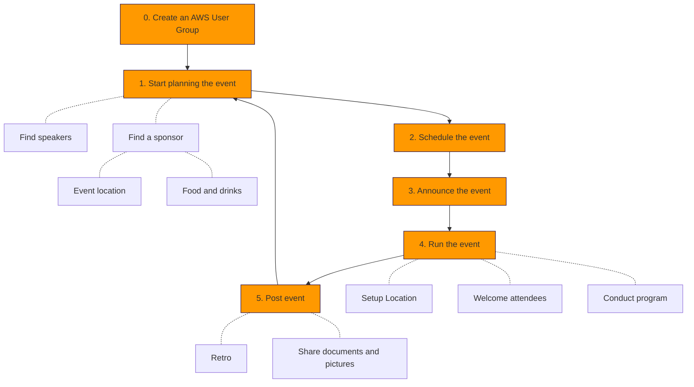

# Best Practices

This page guides running a new AWS User Group based on the experience of existing ones.
The diagram shows common steps for organizing a meetup.
Depending on the size of the meetup additional steps may be required.



Each of the steps above are described in more detail below:

- [0. Getting Started](#0-create-the-aws-user-group)
- [1. Start planning your event](#1-start-planning-you-event)
  * [Find Speakers](#find-speakers)
  * [Sponsorships](#sponsorships)
- [2. Schedule a new event](#2-schedule-a-new-event)
  * [Booking](#booking)
- [3. Announce the event](#3-announce-the-event)
- [4. Run the event](#4-run-the-event)
  * [Preparation](#preparation)
  * [Event Introduction](#event-introduction)
  * [Hosting the event](#hosting-the-event)
- [5. Post event](#5-post-event)
- [AWS User Group Host and Organizer Checklists](#aws-user-group-host-and-organizer-checklists)
  * [Host Checklist](#aws-user-group---host-checklist)
    + [Confirm event details](#confirm-event-details)
    + [Set up the event space](#set-up-the-event-space)
    + [Plan food and refreshments](#plan-food-and-refreshments)
    + [Assist with event check-in](#assist-with-event-check-in)
    + [Foster a welcoming and inclusive atmosphere](#foster-a-welcoming-and-inclusive-atmosphere)
    + [Coordinate with speakers and organizers](#coordinate-with-speakers-and-organizers)
  * [Organizer Checklist](#aws-user-group---organizer-checklist)
    + [Manage communications ahead of the event](#manage-communications-ahead-of-the-event)
    + [Manage time during the event](#manage-time-during-the-event)
    + [Facilitate audience engagement](#facilitate-audience-engagement)
    + [Post-event tasks](#post-event-tasks)
- [General notes](#general-notes)
  * [Ask for help](#ask-for-help)

## 0. Create the AWS User Group

AWS User Group organizers should begin by reaching out to the [AWS Community team](mailto:awscommunity@amazon.com) to express their interest in starting a new group. 
After receiving confirmation, you can create your AWS User Group on your chosen platform. The AWS Community team will then add your group to the official User Group page and Slack channel. For detailed setup instructions, please refer to the [AWS User Group Knowledge Base](https://aws.amazon.com/developer/community/usergroups/). 

Managing a group on your own can be challenging, so having a team of dedicated co-organizers is ideal. Collaborating with others helps distribute the workload and broadens your network.

## 1. Start planning your event

### Find Speakers

Create a **submission form** for talk proposals, similar to this example: [Speaker Proposal Form](https://bit.ly/AwsUgLisbonSpeakerForm)

Pro Tip: Sessionize offers a community license for free events. [Learn more](https://sessionize.com/playbook/community-license)

### Sponsorships

Set up a [form](https://bit.ly/AWSugSponsors) for companies interested in sponsoring your event and reach out to local technology firms, as many are keen to support such events.

Choose a venue in a central location—downtown is ideal for easy access for most attendees.

What to Offer Sponsors:
- **Visibility:** Feature their logos on the event banner and landing page, including a link to their website.
- **Engagement:** Provide space for a small table at or near the event location for direct interaction with attendees.
- **Speaking Opportunity:** Allow up to 15 minutes of stage time for the sponsor. Ensure this time is supplementary and not the main focus of the event.

## 2. Schedule a new event

When planning your event, ensure the agenda includes the following details for each talk:

```
- A brief bio of the speaker
- A compelling title
- A paragraph outlining the content of the presentation or demo
```

For hands-on demos, confirm that the WiFi infrastructure can support the expected number of attendees.

Choosing the right date and time is crucial. Many meetups are scheduled on Tuesdays, Wednesdays, or Thursdays in the evening. However, adapt your choice based on local preferences and cultural norms.

### Booking

If room capacity is a concern, consider implementing **overbooking**.

Typically, about 30% of those who RSVP may not attend. It’s also a good idea to send a reminder message to the meetup group, asking attendees to cancel their RSVP if they are unable to attend, to free up space for others.

## 3. Announce the event

To attract more attendees to your upcoming event, consider the following strategies:

- Engage Local Meetups: Reach out to other meetups in your area and share details about your event. Be sure to reciprocate by promoting their events as well.
- Utilize Social Media: Share your event across your social media channels and notify the [AWS Community team](mailto:awscommunity@amazon.com) for additional exposure. You can also use the Slack workspace to amplify your message.
- Leverage Newsletters and Podcasts: Feature your event in relevant newsletters and podcasts to reach a wider audience.

## 4. Run the event

Here are some key tips to ensure your event runs smoothly:

### Preparation
- Direct Attendees to the Event Location: Clearly label the path from the street to the event space to help attendees find their way easily.
- Prepare the Speaker Room: Conduct a technical check, arrange seating, and ensure all necessary equipment is ready to use.
- Guide Attendees at the Venue: Clearly label directions to restrooms, elevators, terraces, and any other commonly visited areas. If there are "restricted" areas, make sure they are marked as well.
- Food Setup: Designate ample space for food, especially if catering for a large group. Clearly label ingredients to accommodate allergies and preferences (e.g., vegan, halal).

### Event Introduction

When introducing the event, it’s important to cover a few key points to set the tone and ensure everyone is informed:

- Welcome Everyone: Start by warmly welcoming all attendees.
- Photography Disclaimer: Inform attendees that photos will be taken during the event, and some may be shared publicly.
- Thank the Sponsor(s): Acknowledge and thank the sponsors for their support.
- Encourage Feedback: Let attendees know how they can reach the organizers to ask questions or provide feedback about the event.

### Hosting the event

Here are some insights for effectively facilitating the event:

- Hosting: Designate one of the organizers as the host to welcome attendees, introduce speakers, and provide general guidance throughout the event.
- Managing Speaker Times: Talks can sometimes run longer than planned, especially if the audience is highly engaged. For smaller meetups, you can be flexible, but for larger events, it’s important to politely keep things on schedule.

## 5. Post event

If possible, record videos of the presentations and take photos to share on social media and the event page afterward.

You should also share the presentation slides with all attendees after the event.

It's also a good idea to have a debrief with the other organizers to discuss what went well and identify areas for improvement for future events.

## AWS User Group Host and Organizer Checklists

These checklists are designed to support you in your role as a venue host or organizer for an AWS User Group event. They provide a structured guide to help you prepare and manage the event effectively.

### AWS User Group - Host Checklist

Thank you for hosting your event! This checklist will help you prepare the venue and ensure a seamless experience for all attendees.

#### Confirm event details

- [ ] Verify the event date, time, and location.
- [ ] Ensure the venue is available and can accommodate the expected number of attendees.
- [ ] Confirm if any permits or permissions are required for hosting the event.

#### Set up the event space

- [ ] Arrange seating, tables, and necessary presentation equipment (e.g., projector, screen, microphones).
- [ ] Test all equipment to ensure it’s working correctly.
- [ ] Provide clear signage directing attendees to the event space, including restrooms and other key areas.

#### Plan food and refreshments

- [ ] Coordinate with the organizers on the type and amount of food and drinks to be provided.
- [ ] Ensure dietary restrictions and allergens are considered and clearly labeled.
- [ ] Schedule the delivery of food and refreshments to align with the event’s timeline.

#### Assist with event check-in

- [ ] Greet attendees as they arrive and manage the check-in process if necessary.
- [ ] Provide attendees with venue information, such as restrooms and emergency exits.
- [ ] Distribute name tags or other identification materials if required.
- [ ] Ensure accessibility needs are met, such as providing wheelchair access or sign language interpreters.
      
#### Foster a welcoming and inclusive atmosphere

- [ ] Create a welcoming environment that promotes inclusivity and respect for all attendees.

#### Coordinate with speakers and organizers

- [ ] Review the event agenda and communicate any last-minute changes.
- [ ] Ensure speakers have everything they need for their presentations (e.g., clicker, adapters).
- [ ] Assist with setting up and troubleshooting any presentation equipment.

### AWS User Group - Organizer Checklist

As an organizer, your role is crucial in managing the event's various aspects. This checklist will guide you through the necessary tasks before, during, and after the event to ensure its success.

#### Manage communications ahead of the event
- [ ] Send logistics details to speakers, including presentation time and setup requirements.
- [ ] Request the speaker’s headshot and preferred bio.
- [ ] Review the speaker’s slides in advance to ensure they align with event guidelines.
- [ ] Specify screen dimensions (e.g., 4:3 or 16:9 aspect ratio) for presentations.
- [ ] Allocate time for Q&A and networking opportunities.
- [ ] Create a survey for attendee feedback and generate a QR code for easy access.
- [ ] Prepare housekeeping slides to loop at the beginning and end of the event, including the survey QR code.

#### Manage time during the event

- [ ]  Serve as the emcee to cover housekeeping items and introduce speakers.
- [ ]  Monitor the schedule and remind speakers of time limits as needed.
- [ ]  Assist with transitions between speakers or activities to maintain the event flow and make any necessary announcements.

#### Facilitate audience engagement

- [ ]  Encourage attendees to participate in discussions or activities.
- [ ]  Assist with Q&A sessions as needed.
- [ ]  Prompt attendees to complete the feedback survey at the end of each session, while the experience is still fresh in their minds.

#### Post-event tasks

- [ ] Help with clean-up and restore the event space to its original state.
- [ ] Collect any lost-and-found items for attendees to claim.
- [ ] Thank attendees for their participation and invite them to future events.
- [ ] Upload videos or photos for post-event promotion and share them with the community.


## General notes

### Ask for help

If you have any further questions, feel free to ask in the AWS User Group Slack or contact the [AWS Community team](mailto:awscommunity@amazon.com).
